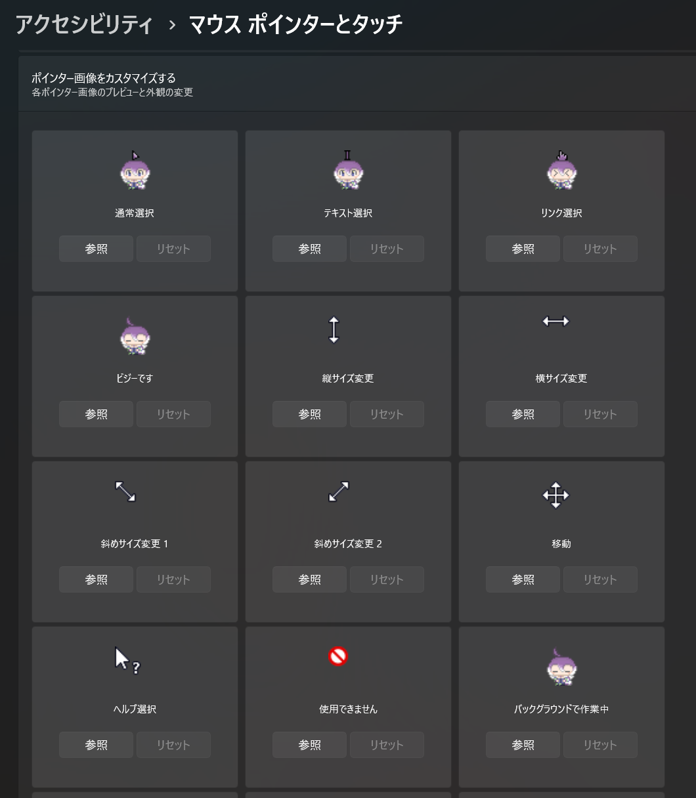

これは少女革命計画の美古途さんの二次創作マウスカーソルです。

ダウンロード  
[Releasesページからどうぞ](../../releases)

設定手順（Windows11の場合）
1. .curファイルと.aniファイルをCドライブ\Windows\Cursors フォルダ内にコピーする
2. Windowsの設定を開き、アクセシビリティ→マウスポインターとタッチ→ポインター画像をカスタマイズする
3. 以下のカーソルの画像を手順1でコピーした画像に変更する
   - 通常選択 → mikoto_arrow.ani
   - テキスト選択 → mikoto_beam.cur
   - リンク選択 → mikoto_link.cur
   - ビジーです / バックグラウンドで作業中 → mikoto_busy.ani

利用規約など
- 個人利用の範囲で使ってください
- 二次配布はしないでください
- AI学習には使わないでください
- 商用利用はしないでください

制作者  
びぐあいらん（ https://x.com/bigIsland_paint ）
